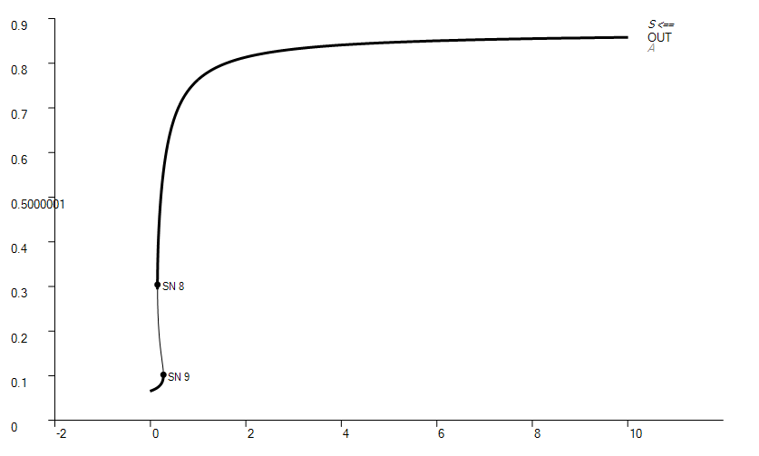
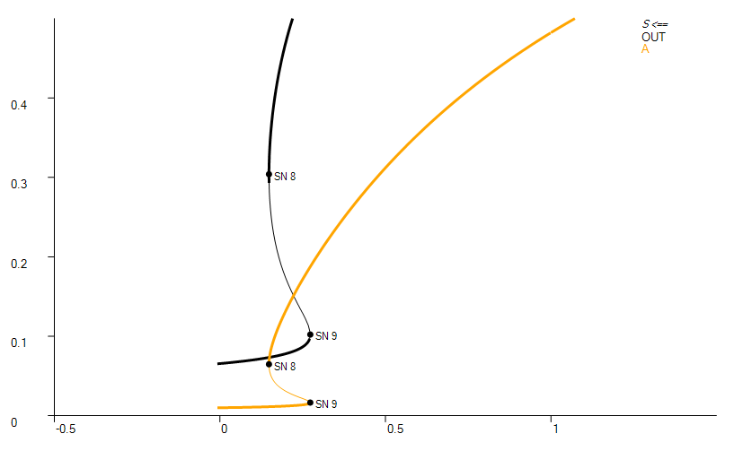
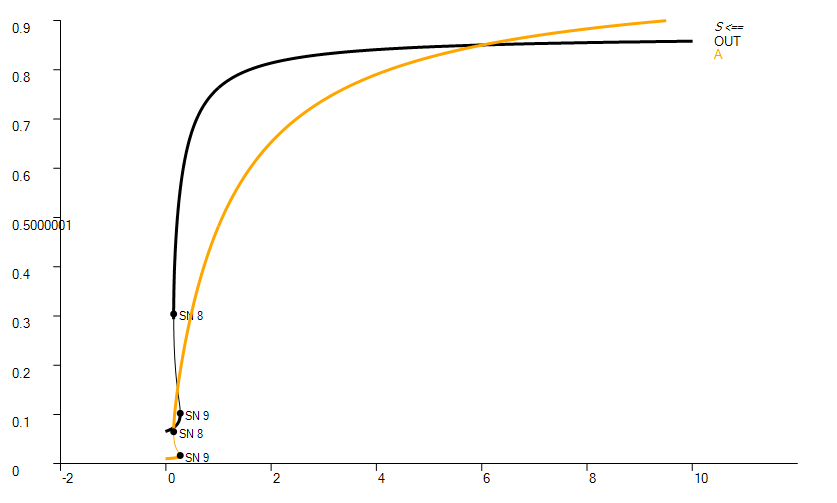
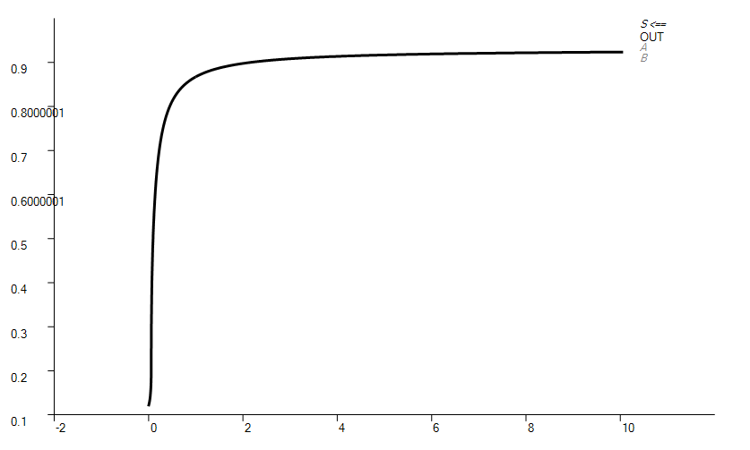
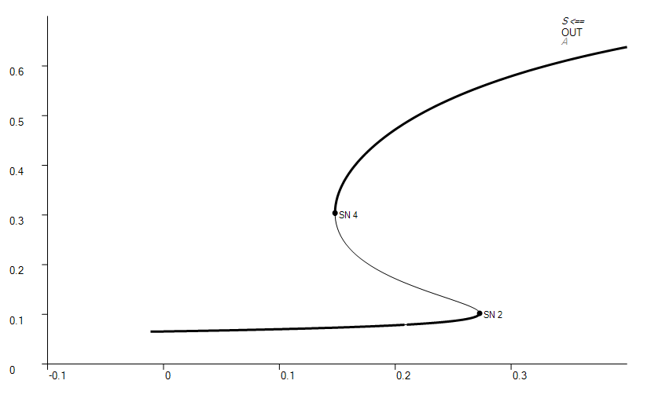
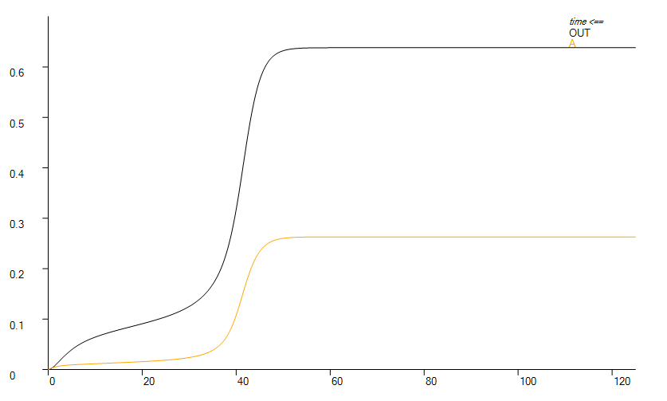
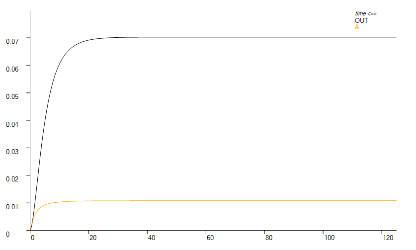
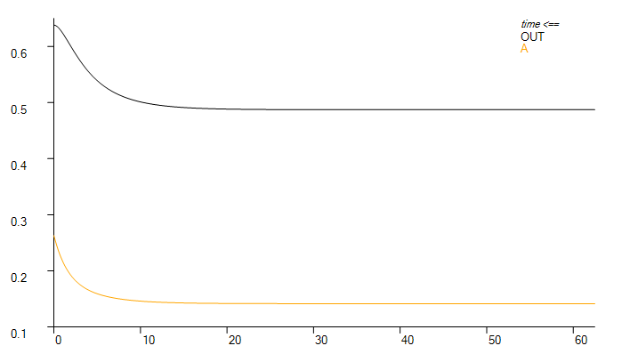

# 
Assignment 2
> 
 221505023 张牧原 

## Bifurcation Analysis
### One Loop
1. one fast loop
> 
 bifurcation diagram of one fast loop

2. one slow loop
> 
 bifurcation diagram of one slow loop

Both one-loop systems share the same bifurcation character, which contains TWO bifurcation points (SN).

### Two Loops
1. Two fast loops
> 
 bifurcation diagram of two fast loops

2. Two slow loops
> 
 bifurcation diagram of two slow loops

3. One slow and one fast loops
> 
 bifurcation diagram of One slow and one fast loops

All of the two-loop systems share the same bifurcation character, which contains NO bifurcation point.

## History-(In)dependent Properties of the System
Let's take the one-fast-loop system for instance.
From bifurcation analysis above, we can infer that one-loop systems contains 2 SN points on approximately S=0.15 & 0.28. Between them is called a bistable area, where coexist two steady states, one at a higher concentration of *OUT*, the other at a lower concentration of *OUT* .

To illustrate the history-dependent properties of the system, it's acceptable to find distinct steady states of *[OUT]* and *[A]* outside the bistable area (here I chose S=0.1 and S=0.4). Then use them as two diffenrent sets of initial conditions of *OUT* and *A* to illustrate the "history effect"  on system.

> 
 S=0.4

> 
 S=0.1

The result goes:
~~~
S=0.4 steady state:
	[OUT]=0.638
	[A]=0.263
    it shows higher concentrations
 S=0.1 steady state:
	[OUT]=0.0702
	[A]=0.0108
    it shows lower concentrations
~~~

Now it's time to invest the two different sets of initial conditions into the bistable area of the system (here I chose S=0.21). The result gose:
> 
 higher concentration set of initiation

> 
 lower concentration set of initiation

The result goes,
~~~
S=0.21,init=high,steady state:
	[OUT]=0.487;
	[A]=0.1415;
 S=0.21,init=low,steady state:
	[OUT]=0.0794;
	[A]=0.0124;
~~~
which means two different set of initial conditions can drive the same system into two different steady state, during bistable area.

***DONE***

